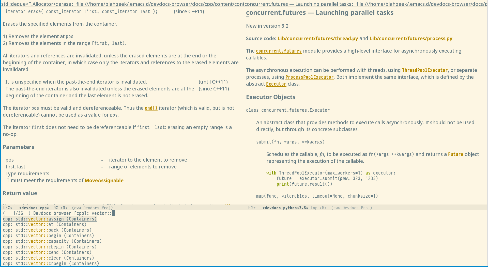

# Emacs Devdocs Browser

Browse devdocs.io documents inside Emacs!

## Features

- Browse API documentations provided by [devdocs.io](https://devdocs.io/) inside Emacs using [EWW](https://www.emacswiki.org/emacs/eww), with:
  * Specifically improved formatting, including highlighted code blocks
  * Extra commands like "jump to other sections", "open in default browser"
- Manage (install, upgrade, uninstall, etc.) docsets
- Optionally download full content for offline usage

## Quick Start

1. Install package.

This package is not submitted to MELPA yet,
you need to manually clone this git repo and add it to `load-path`,
or use some package manager like [straight.el](https://github.com/raxod502/straight.el).

This package does not depend on other libraries and should work with emacs >= 27.1.

2. Invoke `M-x devdocs-browser-install-doc` to install some docs.
3. Invoke `M-x devdocs-browser-open` or `M-x devdocs-browser-open-in` to browse some entry.

## FAQ

- Why browsing the doc inside Emacs instead of opening the page in the web browser?

Less navigation, consistent theme/color, consistent keybindings.

- Why using EWW instead of XWidget, [emacs-webkit](https://github.com/akirakyle/emacs-webkit) or [EAF](https://github.com/manateelazycat/emacs-application-framework/)?

    1. EWW is a builtin package and written in elisp: works across platforms, well supported, customizable.
    2. EWW is text-based: consistent theme/color, consistent keybindings, copiable and searchable, faster and use less resources.
    
- Why Devdocs.io instead of [Dash docs](https://github.com/dash-docs-el/helm-dash)?

Devdocs.io provides all API documentations converted to plain HTML content
without custom styling, scripting, headers or footers, which makes it very suitable for EWW.

## References

All public functions and variables are documented in the code.
Here list some common used ones.

### Docsets Management

Useful functions:

- `devdocs-browser-list-docs`
- `devdocs-browser-update-docs`
- `devdocs-browser-install-doc`
- `devdocs-browser-uninstall-doc`
- `devdocs-browser-upgrade-doc`
- `devdocs-browser-download-offline-data`
- `devdocs-browser-remove-offline-data`

Each docset have a *SLUG* and a *NAME*.
*SLUG* is the unique id (e.g. `python~3.8`) and *NAME* is a human-readable string (e.g. `Python`).
Pay attention to the type of the arguments (usually `slug` or `slug-or-name`) of each functions.

### Open Docset Entry

Useful functions:

- `devdocs-browser-open`
- `devdocs-browser-open-in`

`devdocs-browser-open-in` accept a list of devdocs as parameter
(or read from minibuf when called interactively),
while `devdocs-browser-open` will use the current active docsets by default.

The current active docsets are determined by current major mode
(see `devdocs-browser-major-mode-docs-alist`), or by a buffer-local variable `devdocs-browser-active-docs`.
